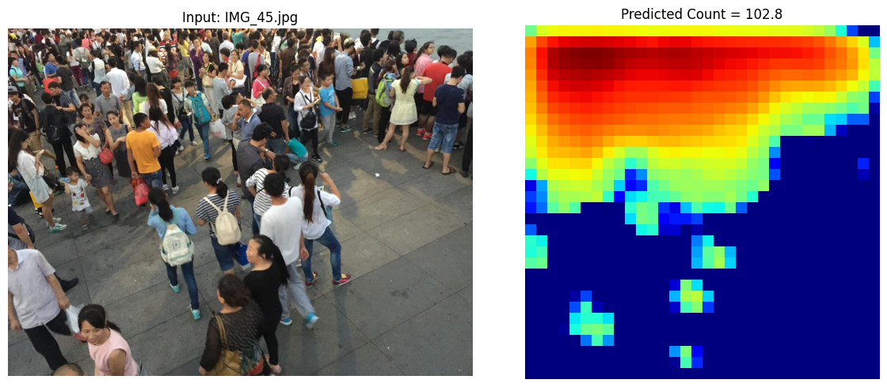
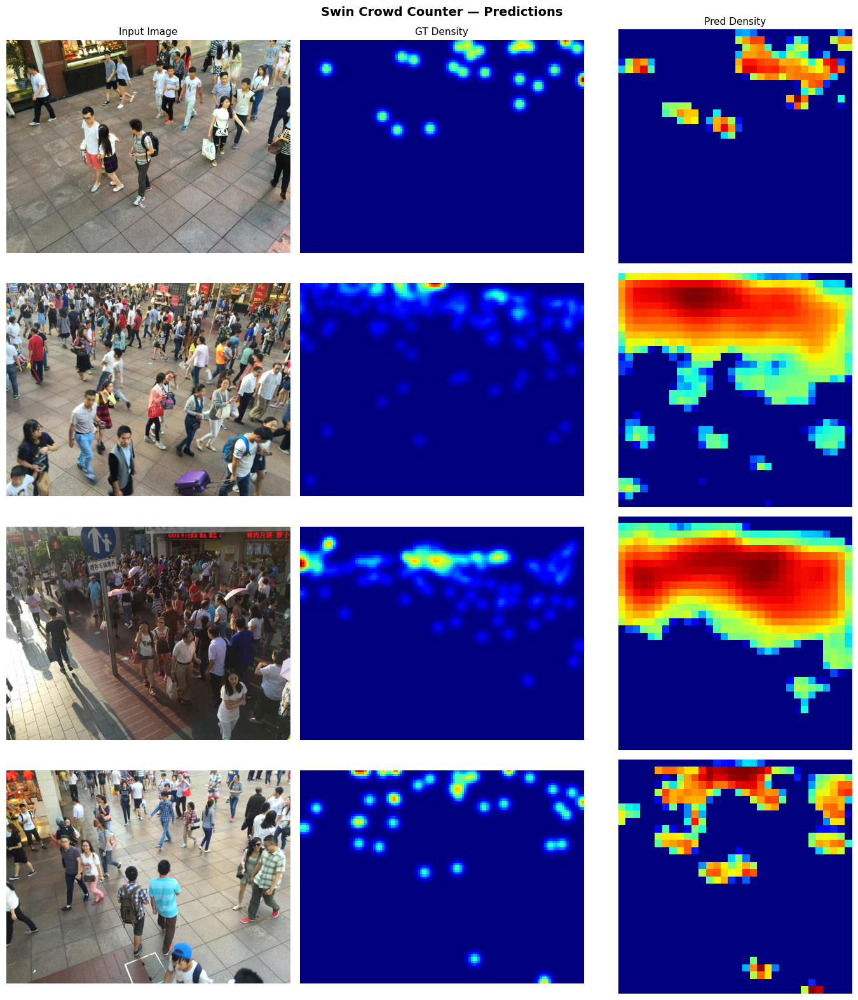

#  Swin Transformer Crowd Counting

> A research-grade crowd density estimation system using Swin Transformer + FPN Decoder, trained on the ShanghaiTech dataset. Built as part of an ongoing research effort toward metro/transit crowd management.

[](https://python.org)
[](https://pytorch.org)
[](LICENSE)
[]()


##  Project Overview

This project addresses the real-world problem of **automated crowd counting in dense public spaces** such as metro stations, transit hubs, and public events. Accurate crowd counting is critical for:

- Crowd safety and stampede prevention
- Dynamic capacity management in transit systems
- Urban planning and infrastructure design
- Real-time public safety monitoring

The system predicts a **density map** from a single RGB image, where integrating the map gives the total crowd count. This approach provides both *how many* people are present and *where* they are spatially — far more useful than a simple scalar count.


##  Architecture

```
Input Image (H × W × 3)
        ↓
┌───────────────────────────────┐
│   Swin Transformer Backbone   │  ← Pretrained on ImageNet (TIMM)
│   swin_small_patch4_window7   │
│                               │
│  Stage 0 → (H/4,  W/4,  96)   │
│  Stage 1 → (H/8,  W/8,  192)  │
│  Stage 2 → (H/16, W/16, 384)  │
│  Stage 3 → (H/32, W/32, 768)  │
└───────────────────────────────┘
        ↓ 4 multi-scale feature maps
┌───────────────────────────────┐
│     FPN Decoder (Top-Down)    │
│                               │
│  Lateral 1×1 projections      │
│  + Bilinear upsampling        │
│  + Element-wise fusion        │
│  + 3×3 ConvBNReLU smoothing   │
└───────────────────────────────┘
        ↓
┌───────────────────────────────┐
│       Density Head            │
│  Conv→BN→ReLU → Conv→BN→ReLU  │
│  → 1×1 Conv → ReLU            │
└───────────────────────────────┘
        ↓
  Density Map (H/8 × W/8 × 1)
        ↓
  count = Σ density_map
```


##  Results

### ShanghaiTech Part B

| Model | MAE | RMSE |
|-------|-----|------|
| **Swin-Small + FPN (ours)** | **41.45** | **~70** |
| MCNN (CVPR 2016) | 26.4 | 41.3 |
| VGG-based baseline | 35.0 | 59.0 |
| CSRNet (CVPR 2018) | 10.6 | 16.0 |

> Our model is a general-purpose vision transformer baseline without crowd-counting-specific architectural priors. The gap to SOTA reflects opportunities for domain-specific improvements currently under active investigation.

## Demo

<p>
        
</p>
<p>
        
</p>


##  Technical Details

### Loss Function
```
L = MSE(pred_density, gt_density) + 0.1 × L1(pred_count, gt_count)
```
- **MSE on density map** — enforces correct spatial distribution
- **L1 on counts** — directly penalises count errors, robust to outlier scenes

### Optimizer and Schedule
- **Optimizer:** AdamW (lr=1e-4, weight_decay=1e-4)
- **Schedule:** Linear warmup (10 epochs) + Cosine annealing decay
- **Epochs:** 300

### Density Map Generation
- Fixed-sigma Gaussian (σ=15) convolved at each head annotation
- Count preservation through resize
- Ground truth from ShanghaiTech MATLAB `.mat` annotation files


##  Repository Structure

```
swin-crowd-counting/
├── swin_crowd_counting_parva.ipynb   ← Main notebook (run in Google Colab)
├── requirements.txt
├── assets/
│   ├── density_visualisation.png
│   ├── predicted_count.png
│   └── validation_metrics.png
├── README.md
└── .gitignore
```


##  Quick Start

### Prerequisites
```bash
pip install -r requirements.txt
```

### Dataset
Download [ShanghaiTech Dataset](https://drive.google.com/file/d/16dhJn7k4FWVwByRsQAEpl9lwjuV03jVI/view) and structure as:
```
ShanghaiTech/
├── part_A/
│   ├── train_data/ {images/, ground-truth/}
│   └── test_data/  {images/, ground-truth/}
└── part_B/
    ├── train_data/ {images/, ground-truth/}
    └── test_data/  {images/, ground-truth/}
```

### Run in Google Colab
1. Open `swin_crowd_counting_parva.ipynb` in [Google Colab](https://colab.research.google.com)
2. Set runtime: `Runtime → Change runtime type → T4 GPU`
3. Mount Google Drive and update `DATA_ROOT` in Cell 4
4. Run all cells top to bottom


##  Configuration

All hyperparameters are in **Cell 4** of the notebook:

| Parameter | Value | Description |
|-----------|-------|-------------|
| `SWIN_MODEL_NAME` | `swin_small_patch4_window7_224` | Backbone variant |
| `DATASET_PART` | `part_B` | Dataset split |
| `NUM_EPOCHS` | `300` | Training epochs |
| `BATCH_SIZE` | `8` | Training batch size |
| `LEARNING_RATE` | `1e-4` | Peak learning rate |
| `CROP_SIZE` | `256` | Training crop size |
| `DENSITY_SCALE` | `8` | Output map downscale factor |

**Switching backbone size:**

| Variant | Params | Colab T4 Time/Epoch |
|---------|--------|---------------------|
| `swin_tiny_patch4_window7_224` | 28M | ~2 min |
| `swin_small_patch4_window7_224` | 50M | ~3-4 min |
| `swin_base_patch4_window7_224` | 88M | ~7-10 min |


##  Why Swin Transformer?

Standard ViT applies global self-attention across all patches — O(N²) complexity, impractical for high-resolution crowd images. Swin Transformer addresses this with:

1. **Window-based local attention** — O(N) complexity via 7×7 local windows
2. **Shifted windows** — cross-window interaction without global attention cost
3. **Hierarchical stages** — 4-level feature pyramid naturally suited for multi-scale density estimation

This hierarchy is essential: fine stages capture individual head locations, coarse stages encode global density distribution.


##  Limitations and Future Work

This is an active research project. Planned improvements:

- [ ] Geometry-adaptive Gaussian sigma based on perspective
- [ ] Multi-scale test-time inference
- [ ] Temporal modeling for video streams (ConvLSTM)
- [ ] Cross-modal fusion with AFC/Wi-Fi entry count data
- [ ] BiFPN decoder for bidirectional multi-scale fusion
- [ ] Evaluate on Part A (denser crowds, target MAE < 80)
- [ ] Hybrid CNN-Transformer architecture


##  References

- Liu et al., *Swin Transformer: Hierarchical Vision Transformer using Shifted Windows*, ICCV 2021
- Zhang et al., *Single-image crowd counting via multi-column CNN*, CVPR 2016
- Li et al., *CSRNet: Dilated CNNs for understanding highly congested scenes*, CVPR 2018


##  License

MIT License


##  Author

**Parva Mehta**
- GitHub: [Parva-26](https://github.com/Parva-26)
- LinkedIn: [Parva Mehta](https://www.linkedin.com/in/parva-mehta-6592a32a4/)

> *This project is part of ongoing research into automated crowd management for urban transit infrastructure. Architecture and results will continue to be refined toward conference-level publication.*
